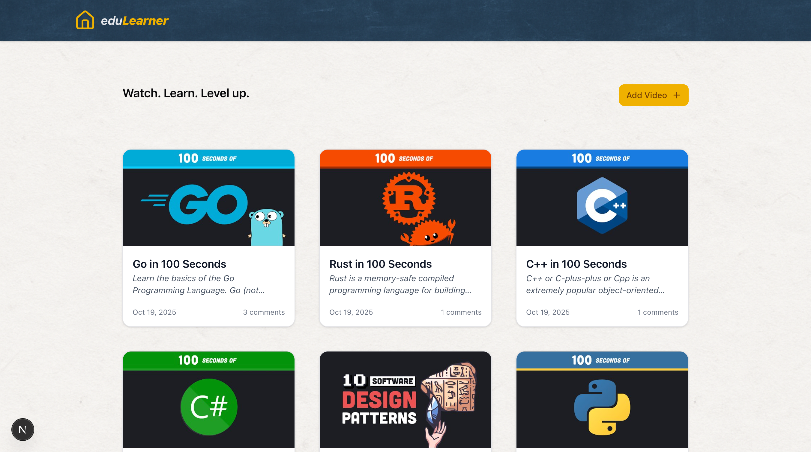
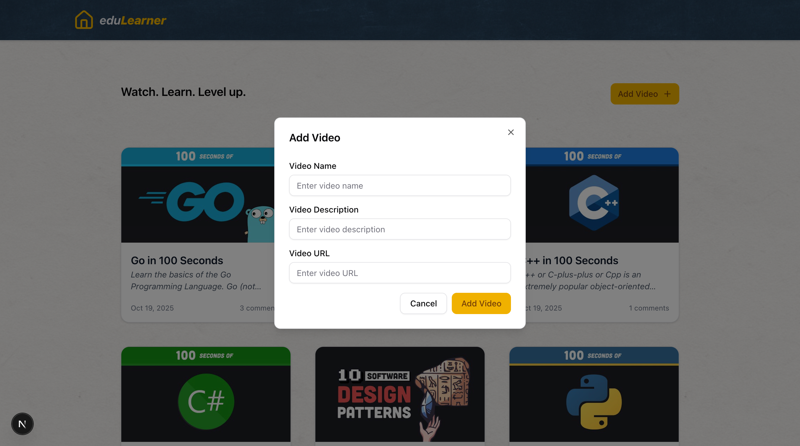

This is a [Next.js](https://nextjs.org) project bootstrapped with [`create-next-app`](https://nextjs.org/docs/app/api-reference/cli/create-next-app).

## Getting Started

First, run the development server:

```bash
npm run dev
# or
yarn dev
# or
pnpm dev
# or
bun dev
```

Open [http://localhost:3000](http://localhost:3000) with your browser to see the result.

You can start editing the page by modifying `app/page.tsx`. The page auto-updates as you edit the file.

This project uses [`next/font`](https://nextjs.org/docs/app/building-your-application/optimizing/fonts) to automatically optimize and load [Geist](https://vercel.com/font), a new font family for Vercel.


## Features
Home page for listings & adding videos, video page for viewing & commenting.
Standard features of viewing, adding and commenting.
Responsive, error and loading states.
Splash Page.

## Solution
Next JS.
First time using tailwind & shadcn, thought I'd try it.
Mostly things were added on a needed basis to prevent premature optimization.
There was no need for global state however I would add zustand, possibly react query for api state/caching performance.
Components are kept clean, hooks added for logic that would be reusable in a larger app & to keeps thing modular.

## User Id
used 'Ross_S' for user id, not snake case , this is set in videoService.ts, you can change it there if you need to.
Thanks!


